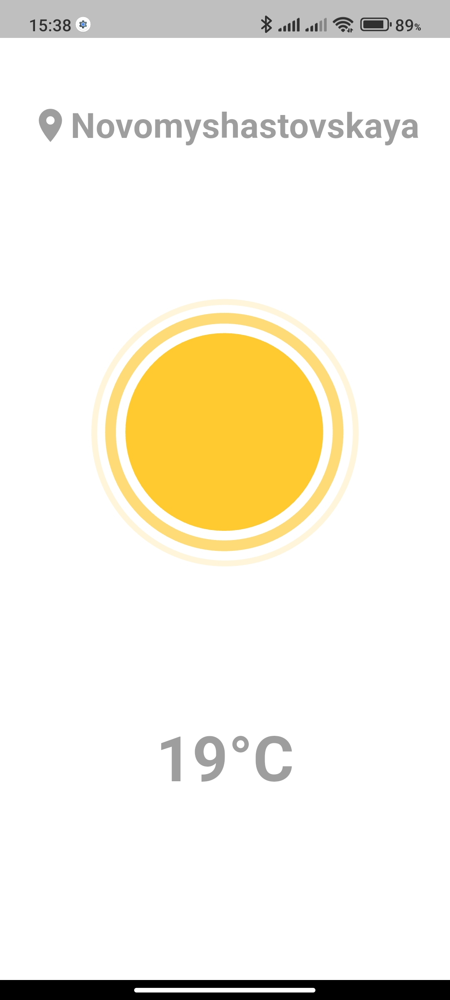
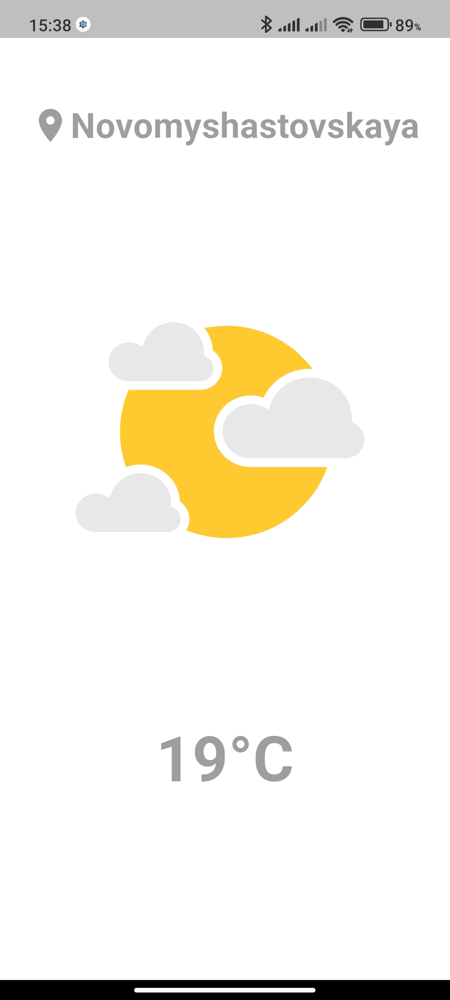
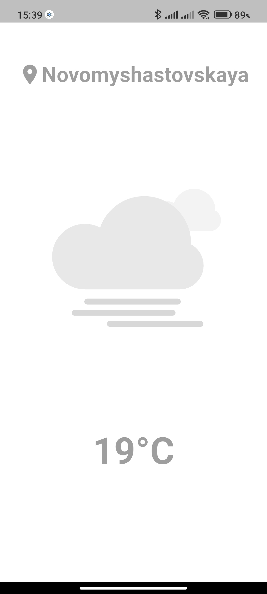
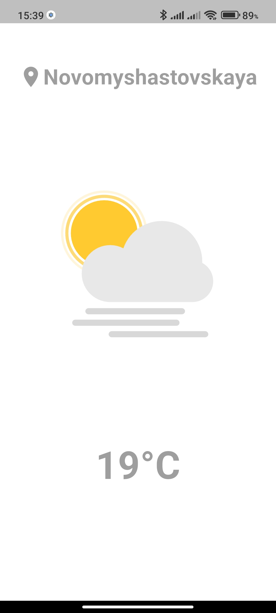
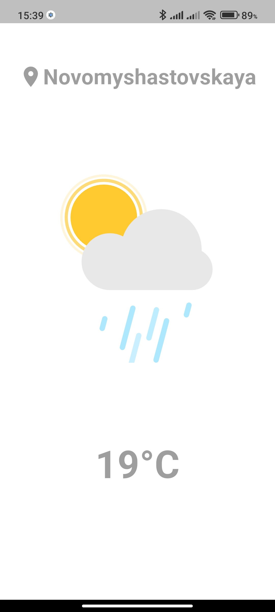
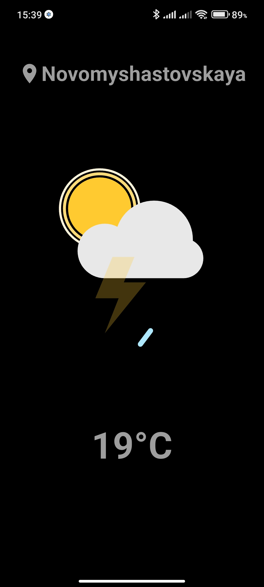
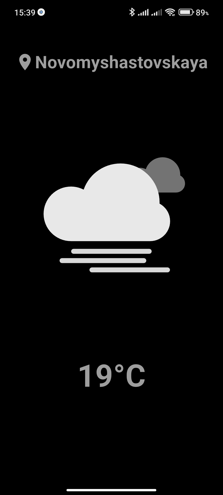
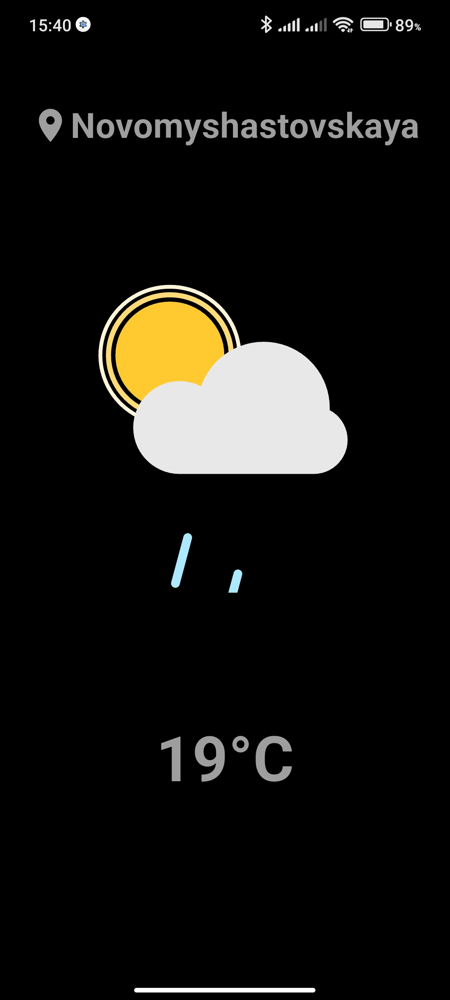

# 🌦️ Flutter Minimal Weather App

Простое и минималистичное приложение прогноза погоды на **Flutter**.  
Использует анимации для отображения текущих погодных условий.

## ✨ Возможности
- Определение текущего местоположения
- Отображение города и температуры
- Красивые Lottie-анимации для разных погодных условий
- Поддержка светлой и тёмной темы

---

## 📱 Скриншоты
assets\screenshots\1.jpg
### Главный экран с Анимацией погоды
<p align="center">
  
  
  
</p>

<p align="center">
  
  
  
</p>

<p align="center">
  
  
  
  
</p>

---

## 🚀 Запуск
```sh
flutter pub get
flutter run
